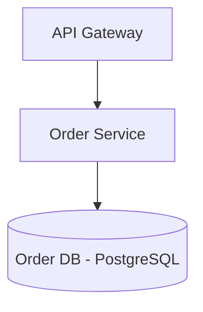

# Demo: C2M-Architect

**User Request:** "Extract Order Management from a Spring Boot monolith into a NestJS microservice using PostgreSQL."

---

# Monolith Migration Plan: NestJS Order Service

## 1. Domain Architecture Diagram (Mermaid)


## 2. Bounded Context Map
- **Service Name:** Order Service
- **Type:** Core
- **Components Migrated:** `com.monolith.order.OrderController`, `com.monolith.order.OrderService`

## 3. Communication Interface
```yaml
openapi: 3.0.0
info:
  title: Order Service API
  version: 1.0.0
paths:
  /orders:
    post:
      summary: Create order
      responses:
        '201':
          description: Created
```

## 4. Docker Compose Environment
```yaml
version: '3.8'
services:
  order-db:
    image: postgres:15
    ports:
      - "5432:5432"
    environment:
      POSTGRES_DB: order_db
```
